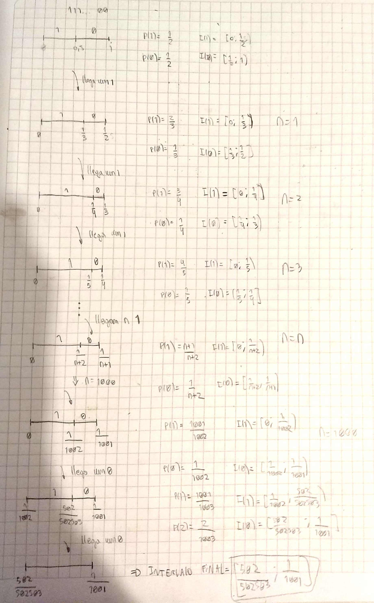

# Ejercicio 1
## _Consigna:_ 

Se tiene un archivo con 10 caracteres en total formado por tres caracteres distintos (ej:ABC). De todos los archivos posibles con estas características mostrar el archivo de máxima entropía que se pueda comprimir mejor usando LZ77. No es necesario comprimir el archivo.

## _Resolucion:_

La entropia de un archivo se define como la esperanza de la longitud de los codigos que representan cada uno de sus mensajes.

$H(x) = \sum_{i=1}^{n}P_{i}l_{i}$, donde

$P_{i}$ = Probabilidad del mensaje _i_ de ocurrir

$l_{i}$ = Longitud del codigo que representa dicho mensaje.

Si queremos entender la entropia como una medida de la _cantidad de informacion_ que contiene un archivo, debemos calcularla para los codigos de longitud minima posible que representen los mensajes de dicho archivo. Esta longitud ideal puede calcularse como 

$l_{i} = -log_{2}(P_{i})$

Por lo que la entropia de un archivo puede definirse como

$H(x) = \sum_{i=1}^{n}-P_{i}log_{2}(P_{i})$

La entropia se maximiza cuando los mensajes son equiprobables. De aqui podemos deducir que para la consigna pedida, aquellos que tienen entropia maxima son los que presentan la misma cantidad de caracteres A, B, y C. Por ejemplo, AAABBBCCCC. 

Dado que el archivo debe ser facilmente compresible mediante LZ77, entonces este debe presentar repeticiones de longitud maxima posible. Se propone el siguiente archivo:

_**ABCABCABCA**_

Donde podemos ver que los unicos caracteres originales son los primeros 3 A,B,C y el resto del archivo es una gran repeticion. 

La compresion de este archivo resultaria algo de la siguiente forma:

_**0A 0B 0C 1(2,7)**_

----------------

# Ejercicio 2

## _Consigna:_ 

Explique en que casos sería una buena idea usar un compresor aritmético estático de orden
3.

## _Resolucion:_

Dado que estamos utilizando un compresor estatico de Orden 3, un primer aspecto a tener en cuenta es que las tablas de probabilidades deben armarse para cada contexto posible de 3 caracteres dentro del documento, lo cual daría lugar a un overhead de compresión bastante alto, por lo que aplicar tal algoritmo no es buena idea salvo que el tamaño comprimido del archivo sea tan grande que haga despreciable dicho overhead causado por las tablas.

Dicho esto, este algoritmo es buena idea si existen muchos patrones de 3 o mas caracteres que se repiten, dado que estos 3 caracteres de contexto pueden ser utiles para reducir la cantidad de bits necesaria para codificar los caracteres que le siguen, siempre y cuando dichos contextos se repitan mucho dentro del archivo.

----------------

# Ejercicio 3
## _Consigna:_ 

Tenemos un compresor aritmético dinámico de orden 0 que trabaja procesando bit por bit. Si comprimimos un archivo que está formado por una serie de 1000 bits en 1 y luego dos bits en 0. ¿cuántos bits ocupará el archivo comprimido?

## _Resolucion:_

Dado que es un compresor dinámico, y que solamente tenemos 2 caracteres posibles (0 y 1), el compresor partirá de la suposición de que el 0 y el 1 son equiprobables, por lo que dividirá el intervalo $(0,1]$ en partes iguales.

$P(1) = 0.5$, $I(1) = (0,0.5]$

$P(0) = 0.5$, $I(0) = (0.5,1]$

Como se puede ver en el desarrollo de arriba, el intervalo final calculado por el proceso de compresion es

$[\frac{502}{502503};\frac{1}{1001}] = [9.98999011*10^{-4};9.99000999*10^{-4}]$

Por lo cual se debe hallar una representacion binaria de un numero perteneciente a este intervalo. Se propone 

00000000001000001011110000111 

Pensado como un numero en representacion de punto fijo, este numero equivale a 

$2^{-10}+2^{-16}+2^{-18}+2^{-19}+2^{-20}+2^{-21}+2^{-26}+2^{-27}+2^{-28} = 9.989999235*10^{-4}$, que esta dentro del intervalo. La longitud de este codigo es de 29 bits, por lo que esta es la cantidad necesaria para comprimir el archivo.

----------------

# Ejercicio 4

## _Consigna:_ 

Una planta industrial decidió instalar un sistema monitor de temperatura, a fin de obtener
registro de las variaciones que existen, y poder tomar acciones de ser necesario. Dicho
monitor cuenta con un sensor que emite cada 5 segundos un registro (fecha: AAAAMMDD,
hora: HH:MM:SS, Temperatura: XX.XX, Variación: Numérico, puede ser positivo o negativo).
Más allá de las acciones inmediatas que se puedan tomar, esta información se quiere
almacenar para realizar consultas o análisis a futuro. Se pide proponer una solución que
permita almacenar estos datos comprimidos. Se pueden utilizar uno o más algoritmos de los
vistos en clase, o proponer variantes adaptadas a la estructura específica de los datos con
los que se cuentan. Se debe explicar cómo queda la estructura final del archivo, y el análisis
en el que se basó la solución.

## _Resolucion:_

No estoy seguro. Preguntar

----------------

# Ejercicio 5

**Afirmacion A:** La entropia es una aproximacion de cuanto se puede comprimir, dado que no podemos
calcular cuanto se puede comprimir un string

**Respuesta:** Es verdadero. La entropia se puede pensar como una medida de la cantidad de _informacion pura_ que contiene un archivo, es decir, informacion no repetida ni de patrones. Esta cantidad de informacion pura tiene una correlacion directa con _cuanto_ se puede comprimir un archivo.

--------

**Afirmacion B:** Una forma posible de comprimir un stream de datos es utilizar un huffman estático.

**Respuesta:** Es falso. El algoritmo de Huffman estatico requiere saber de antemano la cantidad de ocurrencias de cada caracter dentro del archivo, lo cual es imposible si se trata de un stream de datos, por lo que no seria posible comprimirlo usando dicho algoritmo.

--------

**Afirmacion C:** La entropia puede utilizarse para construir clasificadores de texto.

**Respuesta:** Es FALSO. Se puede clasificar texto utilizando PAQ, que es una tecnica de compresion moderna , que permite en ciertos casos determinar distancia entre textos.

-------

**Afirmacion D:** Un compresor estadistico estático comprime siempre mejor que un compresor estadístico
dinámico.

**Respuesta:** Es VERDADERO. Un compresor estadistico estatico tiene de antemano la informacion respecto de la cantidad de repeticiones de cada caracter en el documento, por lo que los primeros caracteres del mismo se comprimen de forma tan eficiente como los demas, a diferencia de lo que sucede en un compresor dinamico. Un compresor dinamico puede ser _en el mejor de los casos_ tan bueno como uno estatico, si todos los caracteres son equiprobables. 

-----
**Afirmacion E:** Podemos determinar la longitud final del archivo comprimido utilizando huffman estático de
orden 1, calculando la entropía y multiplicándola por la cantidad de caracteres del archivo.

**Respuesta:** Dudoso. Esto es cierto solo en el caso en el que la entropia resulte ser un numero entero, dado que el algoritmo de Huffman codifica los caracteres en un numero entero de bits.

-----

**Afirmacion F:** Tenemos 2 archivos, uno con longitud pequeña y el otro muy grande que se comprimen
utilizando huffman estático de orden 5. Si observamos que tienen la mismas tablas de
frecuencias podemos afirmar que el cociente entre el tamaño del archivo sin comprimir y el
tamaño del archivo comprimido será similar.

**Respuesta:** Falso. Si se utiliza un compresor de orden 5, el overhead de compresion sera increiblemente alto para un archivo pequeño (esto es, el tamaño de los arboles de frecuencia seria incluso ordenes de magnitud mayor al tamaño del documento comprimido), no así es el caso para un archivo de mayor tamaño, en el cual el overhead de compresión puede ser menos significativo en comparación al archivo comprimido. Es por esto que la tasa de compresión no será igual en uno y otro caso.